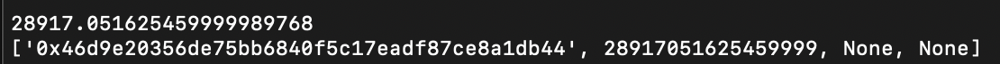
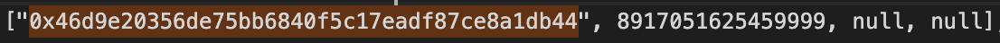

address in old chain: 0x46d9e20356de75bb6840f5c17eadf87ce8a1db44

amount available in claim: 8917.051625459999

amount in the old chain: 28917.051625459999989768

difference new chain - old chain: -20000.0

amount that need to be claimed in the new chain: 20000.0

### Masternodes coins moved during the snapshot, then it's not registered in the balance or in the contract

 
# Screenshot proof:

### In old chain:

### In new chain:

